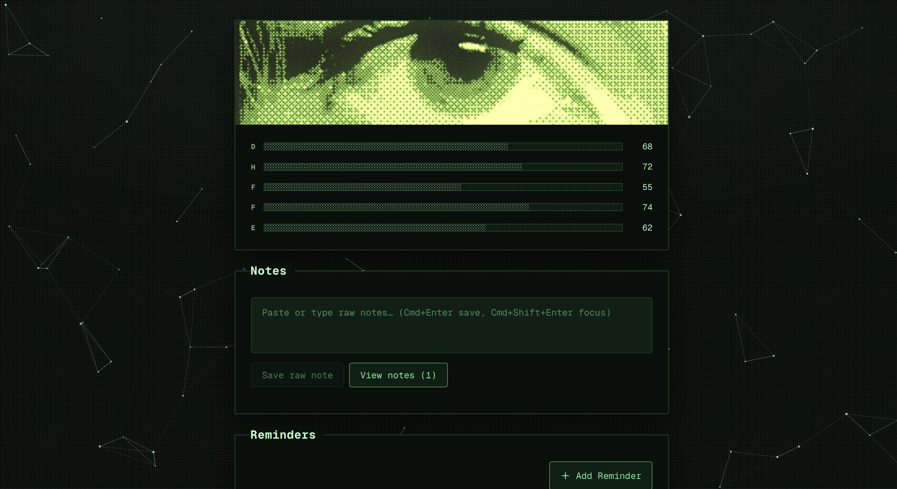
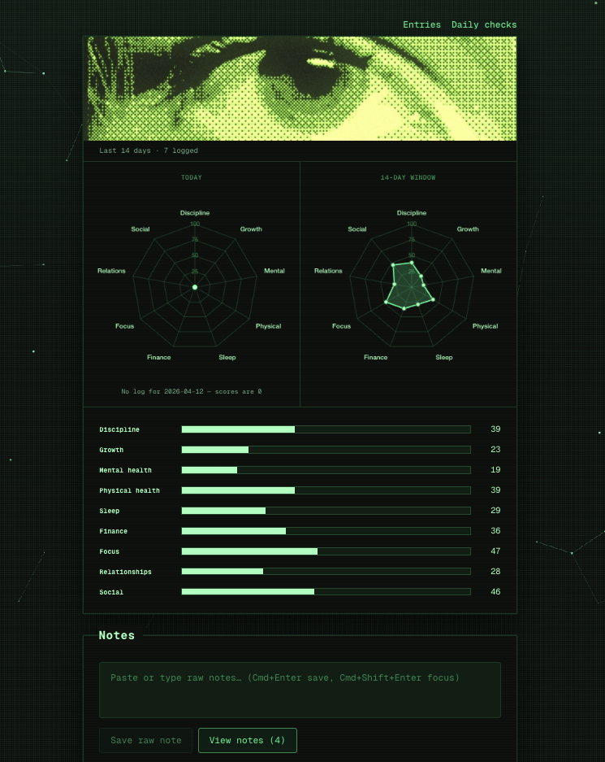

# Self Improvement Dashboard

A high-performance, minimalist command center featuring a Green CRT / Fallout-inspired UI.

Key Features
- Visual Insights: Dynamic Radar Charts for multi-dimensional progress visualization
- Weighted Analytics: Daily checks with weighted variables for precise trend tracking and life management.
- Note Vault: Streamlined interface for rapid note-taking and archival.
- Cron Scheduler: Integrated reminder system for telegram.

#### dashboard v1

- dashboard initialized
  

#### dashboard v2

- ui refactor
  

#### dashboard v3

- 53 unique weighted questions added to have accurate percentages
- radar charts added
  

## Run locally

```bash
npm install
npm run dev
```

Open [http://localhost:3000](http://localhost:3000). Copy `.env.example` to `.env` and set `NEXT_PUBLIC_SUPABASE_URL`, `NEXT_PUBLIC_SUPABASE_ANON_KEY`

## Full DB backup (local)

Requires `pg_dump` (PostgreSQL client tools, e.g. Homebrew `libpq`).

**Easiest:** keep `NEXT_PUBLIC_SUPABASE_DATABASE_PASSWORD` in `.env` and run `supabase link` so `~/supabase/.temp/pooler-url` exists. The backup script merges that URL (correct pooler host, often `aws-1-…`) with your password.

```bash
npm run backup:db
```

Or set `SUPABASE_DB_URL` explicitly (URI from Supabase Dashboard → Database).

Outputs in `backups/`:

- `supabase_full_YYYYMMDD_HHMMSS.dump` (custom format, schema + data)
- `supabase_full_YYYYMMDD_HHMMSS.meta.txt`

Restore example:

```bash
TARGET_DB_URL="postgresql://..." pg_restore --clean --if-exists --no-owner --no-privileges --dbname="$TARGET_DB_URL" backups/supabase_full_YYYYMMDD_HHMMSS.dump
```
