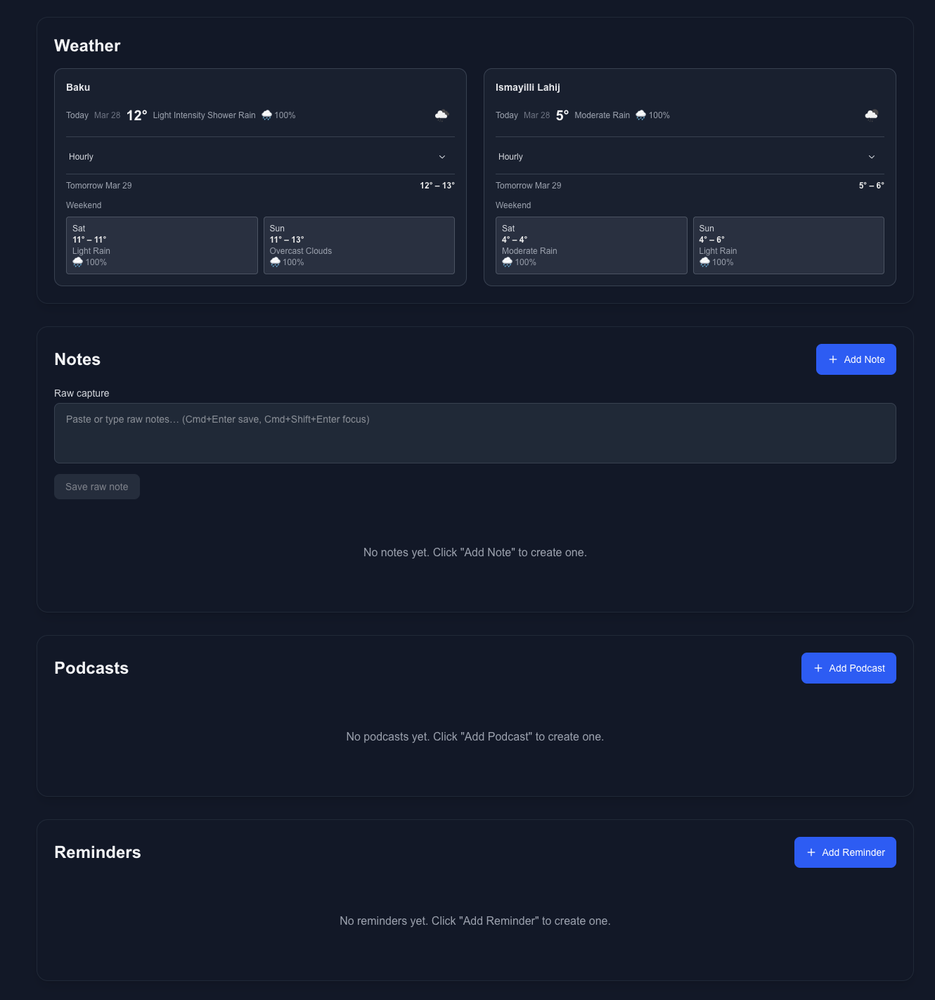
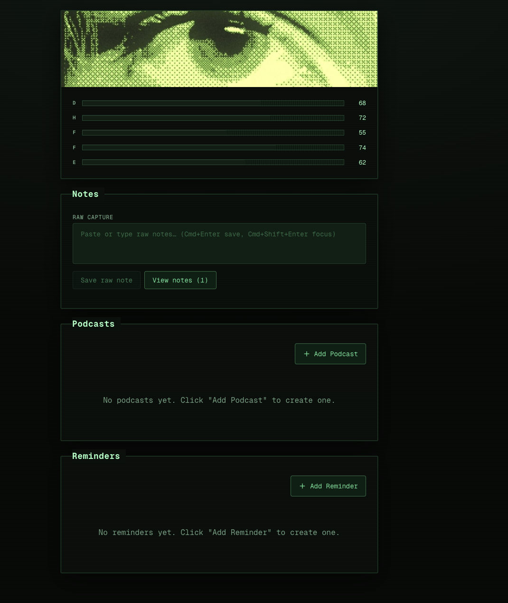

# Personal Dashboard

Private Next.js dashboard with a green CRT-style UI.

#### old one



#### refactored one



## Run locally

```bash
npm install
npm run dev
```

Open [http://localhost:3000](http://localhost:3000). Copy `.env.example` to `.env` and set `NEXT_PUBLIC_SUPABASE_URL`, `NEXT_PUBLIC_SUPABASE_ANON_KEY`

**Ctrl/Cmd + Shift + H** toggles section visibility.
